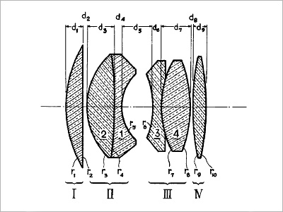
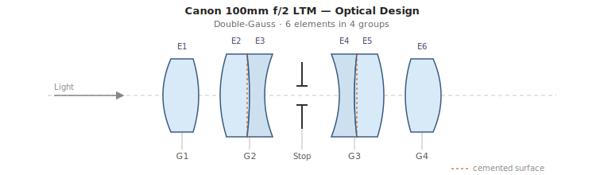
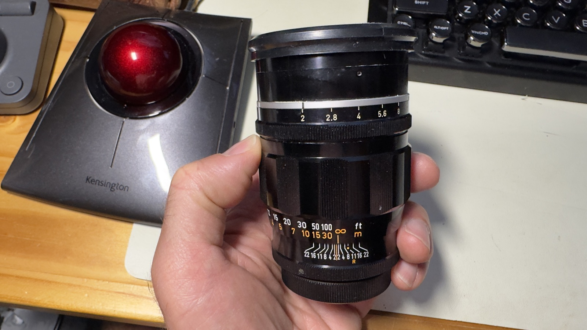
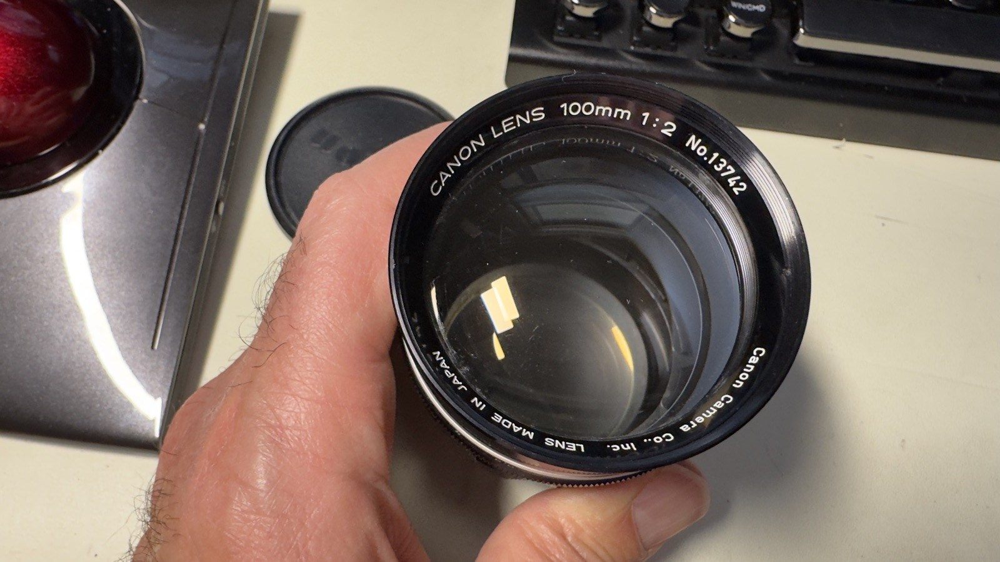
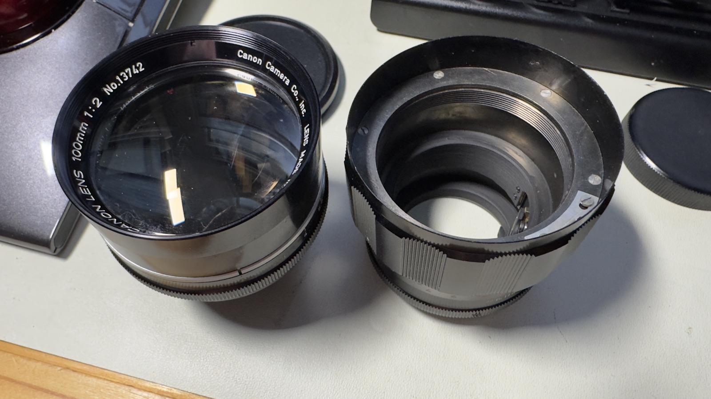
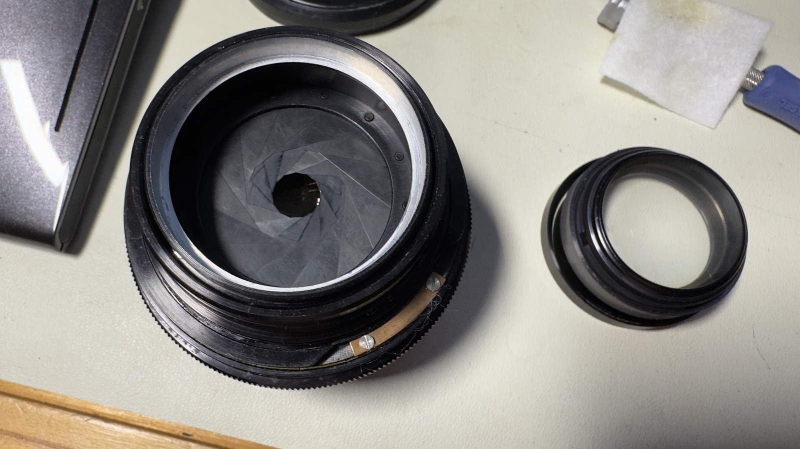

# Canon 100mm f/2 LTM

I bougth this lens after consulation with Claude Opus 4.8. It pointed out that I had no long focal length lenses in my Canon LTM collection, so I figured I'd go for it.

This is a little longer than I'd normally shoot, and because it's 100mm instead of the normal 90 or 135, it doesn't match any normal Leica M framelines. As often as not, I adapt lenses to mirrorless cameras, most recently the Leica EV-1, so not a big problem. An anyway, I tend to use framelines as a rough guide, so I've been using it on my M10.

Cosmetically the lens was in great condition, but it had some nasty haze on an internal element, bad enough that the images were hazey messes. I'm all for a vintage look, but not when it's just caused by damage. 

The aperture blades were in decent shape but look a tad rusty, which is never good for an aperture. 

---

## Specifications

| Spec | Value |
|------|-------|
| Focal length | 100mm |
| Max aperture | f/2 |
| Min aperture | f/22 |
| Elements / Groups | 6 / 4 |
| Aperture blades | 13 |
| Min focus distance | 1.0m |
| Filter thread | 58mm |
| Mount | Leica Thread Mount (M39 × 1mm) |

---

## Optical Design

There isn't a lot of information about this lens, but I did fine one writeup [Pebble Place](https://www.pebbleplace.com/reviews/rangefinder/canon_100mm_serenar/index.html). 
He includes the design of the lens, which is a remarkably symmetic Gaussian design with 6 elements in 4 groups.

. 

This breaks down as a schematic diagram, which I generated for my own edificaiton. 

---

## Tools & Materials

Lenses of this vintage mostly involved flathead screws, which are a pain to deal with. Even worse, some of them are made of brass, which makes it extra-easy to destroy the slot in the screw.

My first piece of advice is to use screwdrivers that fit the slot in the screw very well, both in length and width. Fortunately my Vessel set of screwdrivers worked well, almsot to the point that it made me wonder if Vessel (a Japanese company) made them to match the screws of Japanese lenses of this vintage. 

My second piece advice is to use rubber tools instead of lens spanners as much as possible. Lens spanners are almsot universally instruments of destruction. Get a good set of rubber gloves and a set or two of rubber lens cones of various sizes and use the whenenver possible. Lens spanners should be a last resort, and an act of desparation. 

- Small flathead screwdrivers (#000, #00)
- Rubber friction tools or Rotatool for filter rings
- Lens tissue and sensor swabs
- 99.9% isopropyl alcohol
- Lighter fluid (naptha) — for dissolving old grease and cleaning evaporated grease
- Helicoid grease (e.g. Molykote EM-30L, EM-60L, or Helimax XP)
- Rubber gloves
- Cleaning solution (Eclipse and ROR)
- Loupe or magnifier for element inspection (my favorite: [Belomo aks Trilomo](https://belomostore.com/belomo-10x-triplet-loupe.html/)

---

## Service Steps

### Step 1: Assess the lens

Before disassembly, examine the lens wide open against a light source.

My copy had pretty bad haze near the front of the lens. 

There are two locations for haze: on one of the surfaces exposed to air, and the surface sandwiched between a doublet.

Haze on a surface has a fighting chance of being removable. Haze on the interface inside a double means the lens has to be separted, cleaned, and re-bonded, all of which is possible but very difficult, and requires special equipment. 

We'll see as the service progresses that it was on the surface closest to the aperture. I could only be sure after I'd opened the lense and inspected the elements. I'm not sure why, but often if there are evaporated oil and grease deposits on a lens, they happen at this surface. 

The lens itself was in pretty decent condition, given its age.

Looking through the lens, there was pretty strong haze somewhere inside th lens. Just looking through the lens I couldn't tell if it was on a surface, or if the haze was inside a doublet. 

---

### Step 2: Unscrew the lens block from the focussing body

I used very sticky rubber gloves to unscrew the lens body from the helicoid (aka focussing) assembly. Mine was in pretty tight, but with firm force it came free. There is no set screw or lock ring holding it in place, so use firm force and believe in yourself.

It was clear at this point that the haze was on the surface of the rear element as I metnioned, the surface closest to the aperture blades. I have no idea why oil onlyh depoisted on this side and not the other. 

I tried removing the haze with 99.9% isopropyl alcohol, acetone, naptha, ROR, Zeiss lens cleaner and Eclypse . The naptha made the biggest dent, but there was still significant haze on the surface. The coating was no doubt shot, but I could see from the other surfaces that the coatings were pretty light, so it wasn't a great loss, but I still had to get rid of the haze.

### Step 3: Remove the rest of the optical assembly

Start by removing the set screw in the front part of the lens. I used a 1.2mm Vessel flathead screwdriver, which fit perfectly. 

With the screw removed, the front part of the lense block will unscrew from the rest of the block. With the front and back removed, you'll be left with just the aperture assembly.

![The front and rear components of the block removed](images/100mm-f2-ltm/IMG_7372.jpeg

### Step 4: Really dealing with the haze

Reluctantly, I prepared to polish off the haze, which also meant polishing off the a bit of the surface of the lens. This was inevitable.

There are a few services that can polish and re-coat a lens. I've sent one lens to a guy in Ukraine who did an excellent job re-coating the front element of a 50mm Elmar, with very haze to the haze pattern on this lens. Unfortunately, I wanted to finish this lens in a weekend, and it took several months to send the lens to Jaroslav, get it coated, and receive it back. There's also the possibility that the lens will get lost in transit, so I decided to use my home grown techniques for polishing the lens, developed over years of accidentally destroying lenses.

The main trick, I learned, is to create a polishing surface which matches the curvature of the lens surface being polished, and ideally about the same size, and then rotate the polishing surface gently but firmly with a polishing agent. 

To create the polshing surface, I put a thin lens polshing cloth on the lens surface, then used a curing epoxy (in my case Sugru, which cures with humidition, but you can also use a UV-curing putty if you want to speed things up). I pushed the puttin into the lens to match the surface of the lens, then let the whole thing cure for 24 hours (a UV cure would be faster, of course). I then trimmed the polishing cloth to over-hang the now-curved surface of the hardened epoxy putty. The polishing cloth by this point was reasonably bonded to the epoxiy, forming a soft surfaced that matched the lens curvature. 

I used 3 grades of cerium oxide, the same material used to polish scratches in car windshields. The coarsest was 3.5$\mu$m, then 2.5$\mu$m, and finally $1$\mu$m, all purchased on Amazon. I could have dipped the cloth directly in the polishing compound but found it easer to soak a bit of thick lens cleaning tissue (Pec pads work well) in the preapred polishing compound, then placed it on the lens cloth/epoxy putty tool. 

And then I polished, trying to rotate the polishing tool to keep keep even pressure on the lens surface. 

It took about an hour using the 3.5$\mu$m compound. I used my Belomo loupe to inspect the surface. By the way, the surface looked pockmarked, with an evenly-distrubted surface of raised dots, kind of like the condensation the outside glass of a cold drink. This further convinced me that I was dealing with hardened oil or or grease that somehow deposited on the lens. 

---

### Step 3: Remove the rear element group

Remove the lock ring holding in the rear element gruop. There are two slots for a removal tool, but first try using hand force with sticky rubber gloves, and then a rubber tool if yuo have one that fits over. 

The rear element will then slide out from the rest of the optics block. 

---

### Step 4: Access and separate the helicoid

The focus helicoid is accessed from the front once the element group is removed. Mark the helicoid engagement point with a paint marker before separating — this is critical for recovering infinity focus on reassembly.

Unscrew the helicoid fully. Clean all old grease from the threads using lighter fluid on a cotton bud. Allow to dry completely.

!!! tip "Marking the engagement point"
    Use a small dot of paint pen on both the inner and outer helicoid threads at the point of separation. The helicoid must re-engage at the same thread start or infinity focus will be lost.

---

### Step 5: Clean aperture blades (if oily)

Inspect the aperture blades. If oily, carefully remove the aperture assembly. Wipe each blade with a cotton bud barely dampened with lighter fluid. Blades must be completely matte and dry before reassembly.

!!! danger "Avoid excess solvent near elements"
    Keep solvent away from cemented elements — it can wick under the cement and cause separation.

---

### Step 6: Clean optical elements

Use lens tissue or a sensor swab with a drop of Eclipse. Clean from center outward in a spiral motion. Inspect under a loupe. Haze on internal surfaces sometimes responds to cleaning; coating separation or fungal etching does not.

---

### Step 7: Disassembly the focussing assembly

The front body of the lens rotates while focussing so I knew there would only be 2 helicoids in the assembly, one for the optics block, and one for the rangefinder coupling.

Start by putting the focus focus as infinity and measuring the overall length of the assembly. In my case it was 56.0mm. We'll be doing a lot more measurements so keep the calipers around. 

I wasn't sure where to start, so I started with the 3 small flat-head screws on the knurled forcus ring, using a 1.2mm Vessel screwderivwer.  

---

### Step 8: Verify

The Rangerfinder calibraiton seems off.

I confirmed the flange-to-rangefinder coupling distance is 7.50mm, exactly what it should be, but it looks

---

## Notes

- This lens uses M39 screw mount but has rangefinder coupling — it will couple correctly on Leica M bodies via an M39-to-M adapter, but confirm the adapter passes the RF cam.
- Several variants exist; earlier versions have a different front cosmetic treatment. Optical formula appears consistent across variants.
- If infinity focus is slightly off after reassembly, rotate the front element group in its thread by very small increments — the thread pitch makes this a sensitive adjustment.
