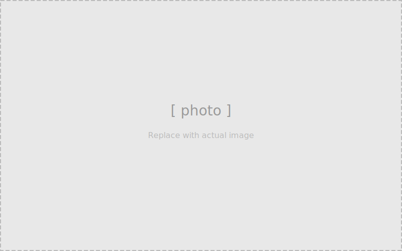

# Nikkor 50mm f/1.4 AIS

One of Nikon's most produced lenses, made from 1981 onward. Extremely well-built and straightforward to service. Common issues are dried focus grease (stiff or notchy focus ring) and dusty elements. The aperture blades rarely get oily unless the lens was stored poorly.

---

## Specifications

| Spec | Value |
|------|-------|
| Focal length | 50mm |
| Max aperture | f/1.4 |
| Min aperture | f/16 |
| Elements / Groups | 7 / 6 |
| Aperture blades | 7 |
| Min focus distance | 0.45m |
| Filter thread | 52mm |
| Mount | Nikon F (AI-S) |

---

## Tools & Materials

- Phillips screwdrivers: #0, #1
- Spanner wrench (adjustable, 30–50mm range)
- Rubber friction grip
- 99% isopropyl alcohol
- Lighter fluid (Ronsonol)
- Helicoid grease (Molykote EM-30L or similar)
- Lens tissue and Eclipse fluid
- Cotton gloves
- Marker (to mark helicoid engagement point)

---

## Service Steps

### Step 1: Assess the lens

Mount on a body or hold to a light source. Look through at maximum aperture for haze, fungus, or separation. Rack focus full travel and note any stiffness. Stop down through all aperture stops.

---

### Step 2: Remove the rear mount

Three Phillips #1 screws secure the rear F-mount plate. Remove them and lift the plate off. The AI-S coupling and aperture lever are now visible.

!!! note "Don't lose the AI follower spring"
    A small spring and ball bearing sit under the aperture coupling lever. They can fall out when the rear plate is removed. Place the lens on a tray before lifting the plate.

---

### Step 3: Remove the rear element group

The rear element group is a threaded assembly that unscrews counterclockwise. Use a rubber grip for friction, or a spanner if it's tight. Set aside element-side up.

---

### Step 4: Separate the helicoids

Remove the three screws on the focus ring collar. The outer helicoid unscrews from the inner. Note or mark the engagement point before separating.

Clean all old grease from both helicoid threads with lighter fluid on a cotton swab. Let dry fully.

Apply a thin, even coat of fresh helicoid grease to the threads. Avoid applying too much — excess will migrate onto blades over time.

!!! tip "Grease amount"
    Less is more. A thin film covering the threads is sufficient. Heavy packing does not improve feel and creates migration risk.

---

### Step 5: Clean optical elements

Use lens tissue or a PEC-PAD with a drop of Eclipse. Clean each element surface. Check with a loupe at an angle to spot remaining smears.

The front element can be unscrewed with a rubber grip or spanner if it needs a thorough clean.

---

### Step 6: Reassemble and verify

Reassemble in reverse. Remember to seat the AI follower spring and ball before installing the rear plate.

Final checks:

- [ ] Focus ring is smooth and damped through full travel
- [ ] Aperture blades are clean and snap crisply
- [ ] Elements are clear — no smears, haze, or debris
- [ ] Rear mount screws are snug
- [ ] Infinity focus is accurate

---

## Notes

- The 50mm f/1.4 AIS is nearly identical internally to the 50mm f/1.8 AIS — service steps are the same.
- Nikon used several different helicoid grease formulations over production life; the original grease dries and becomes waxy with age.
- A well-serviced example should have a smooth, slightly damped focus feel — similar to a well-tuned German lens.
